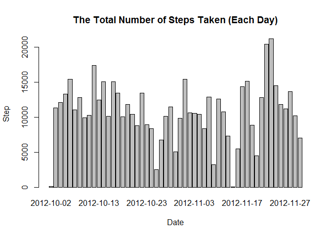
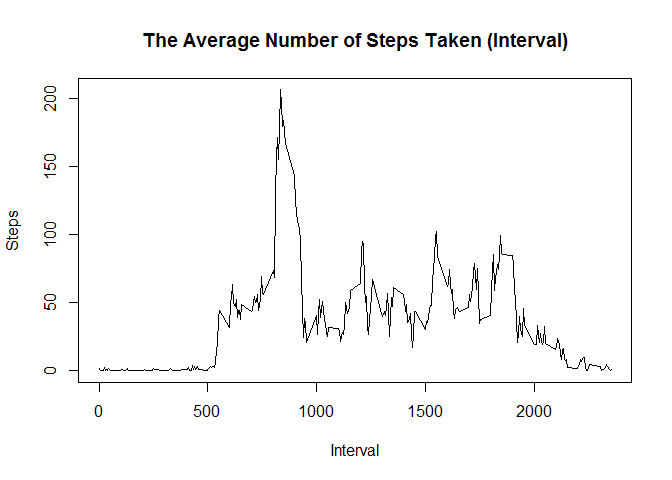
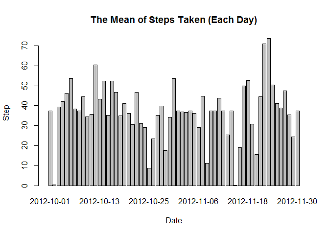
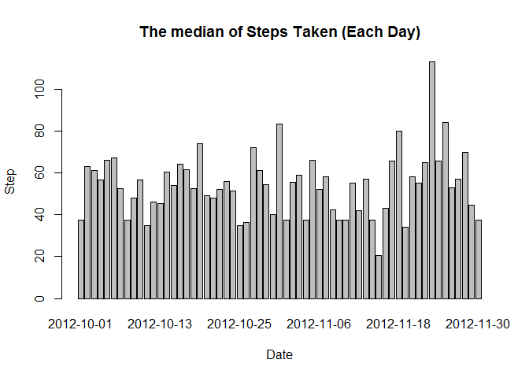
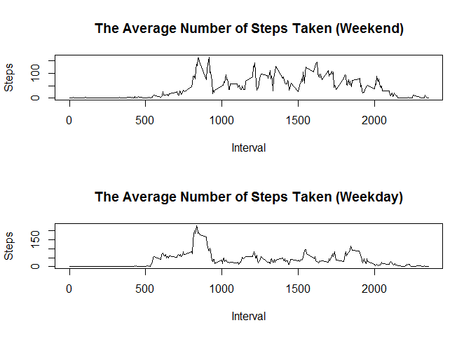

##Reproducible Reserch Peer-graded Assignment: Course Project 1

=============================================================================================================

###Loading and preprocessing the data

1. Load the data


```r
url <- "https://raw.githubusercontent.com/joneschoi/RepData_PeerAssessment1/master/activity.zip"
f <- file.path(getwd(), "activity.zip")
download.file(url, f)
unzip("activity.zip")
act <- read.csv("activity.csv")
head(act)
```

```
##   steps       date interval
## 1    NA 2012-10-01        0
## 2    NA 2012-10-01        5
## 3    NA 2012-10-01       10
## 4    NA 2012-10-01       15
## 5    NA 2012-10-01       20
## 6    NA 2012-10-01       25
```

###What is mean total number of steps taken per day?

1. Make a histogram of the total number of steps taken each day


```r
ActDate <- aggregate( steps~date, act, sum)
barplot(ActDate$steps, name = as.Date(ActDate$date), xlab ="Date", ylab="Step", main="The Total Number of Steps Taken (Each Day)")
```

<!-- -->

2. Calculate and report the mean and median total number of steps taken per day


```r
x <- act[act$steps != 0 ,]
print(aggregate( steps~date, x, FUN = function(x) c(mean = mean(x), median = median(x))), row.names = FALSE)
```

```
##        date steps.mean steps.median
##  2012-10-02   63.00000     63.00000
##  2012-10-03  140.14815     61.00000
##  2012-10-04  121.16000     56.50000
##  2012-10-05  154.58140     66.00000
##  2012-10-06  145.47170     67.00000
##  2012-10-07  101.99074     52.50000
##  2012-10-09  134.85263     48.00000
##  2012-10-10   95.19231     56.50000
##  2012-10-11  137.38667     35.00000
##  2012-10-12  156.59459     46.00000
##  2012-10-13  119.48077     45.50000
##  2012-10-14  160.61702     60.50000
##  2012-10-15  131.67532     54.00000
##  2012-10-16  157.12500     64.00000
##  2012-10-17  152.86364     61.50000
##  2012-10-18  152.36364     52.50000
##  2012-10-19  127.19355     74.00000
##  2012-10-20  125.24096     49.00000
##  2012-10-21   96.93407     48.00000
##  2012-10-22  154.71264     52.00000
##  2012-10-23  101.34091     56.00000
##  2012-10-24  104.43750     51.50000
##  2012-10-25   56.63636     35.00000
##  2012-10-26   77.02273     36.50000
##  2012-10-27  134.92000     72.00000
##  2012-10-28  110.17308     61.00000
##  2012-10-29   80.93548     54.50000
##  2012-10-30  110.32584     40.00000
##  2012-10-31  179.23256     83.50000
##  2012-11-02  143.24324     55.50000
##  2012-11-03  117.45556     59.00000
##  2012-11-05  141.06757     66.00000
##  2012-11-06  100.40964     52.00000
##  2012-11-07  135.61053     58.00000
##  2012-11-08   61.90385     42.50000
##  2012-11-11  132.71579     55.00000
##  2012-11-12  156.01449     42.00000
##  2012-11-13   90.56790     57.00000
##  2012-11-15   20.50000     20.50000
##  2012-11-16   89.19672     43.00000
##  2012-11-17  183.83333     65.50000
##  2012-11-18  162.47312     80.00000
##  2012-11-19  117.88000     34.00000
##  2012-11-20   95.14894     58.00000
##  2012-11-21  188.04412     55.00000
##  2012-11-22  177.62609     65.00000
##  2012-11-23  252.30952    113.00000
##  2012-11-24  176.56098     65.50000
##  2012-11-25  140.88095     84.00000
##  2012-11-26  128.29885     53.00000
##  2012-11-27  158.67442     57.00000
##  2012-11-28  212.14583     70.00000
##  2012-11-29  110.10938     44.50000
```

###What is the average daily activity pattern?

1. Make a time series plot of the 5-minute interval (x-axis) and the average number of steps taken, averaged across all days (y-axis)


```r
ActInt <- aggregate( steps~interval, act, mean)
plot(ActInt$interval, ActInt$steps, type = "l", main = "The Average Number of Steps Taken (Interval)", xlab = "Interval", ylab = "Steps" )
```

<!-- -->

2. Which 5-minute interval, on average across all the days in the dataset, contains the maximum number of steps?


```r
print(ActInt[ActInt$steps == max(ActInt$steps),], row.names = FALSE)
```

```
##  interval    steps
##       835 206.1698
```

###Imputing missing values

1. Calculate and report the total number of missing values in the dataset 


```r
sum(is.na(act$steps))
```

```
## [1] 2304
```

2. Devise a strategy for filling in all of the missing values in the dataset. This use the mean for that 5-minute interval.


```r
IntAss <- aggregate( steps~interval, act, mean)
head(IntAss)
```

```
##   interval     steps
## 1        0 1.7169811
## 2        5 0.3396226
## 3       10 0.1320755
## 4       15 0.1509434
## 5       20 0.0754717
## 6       25 2.0943396
```

3. Create a new dataset that is equal to the original dataset but with the missing data filled in.


```r
Actna <- act[is.na(act$steps) == TRUE,]
Actnay <- merge(x=Actna,y=IntAss,by="interval", all.x = TRUE)
Actnay <- Actnay[,c(4,3,1)]
names(Actnay)[1] = "steps"
Actnan <- act[is.na(act$steps) == FALSE,]
ActAdd <- rbind(Actnan,Actnay)
head(ActAdd)
```

```
##     steps       date interval
## 289     0 2012-10-02        0
## 290     0 2012-10-02        5
## 291     0 2012-10-02       10
## 292     0 2012-10-02       15
## 293     0 2012-10-02       20
## 294     0 2012-10-02       25
```

4. Make a histogram of the total number of steps taken each day and Calculate and report the mean and median total number of steps taken per day. We know that the first report day and the last report day is fill up the same mean.


```r
Actmem <- aggregate( steps~date, ActAdd, mean)
barplot(Actmem$steps, name = as.Date(Actmem$date), xlab ="Date", ylab="Step", main="The Mean of Steps Taken (Each Day)")
```

<!-- -->

```r
Actmed <- ActAdd[ActAdd$steps != 0 ,]
Actmed <- aggregate( steps~date, Actmed, median)
barplot(Actmed$steps, name = as.Date(Actmed$date), xlab ="Date", ylab="Step", main="The median of Steps Taken (Each Day)")
```

<!-- -->

###Are there differences in activity patterns between weekdays and weekends?

1. Create a new factor variable in the dataset with two levels -- "weekday" and "weekend" indicating whether a given date is a weekday or weekend day.


```r
Sys.setlocale("LC_TIME", "English")
```


```r
ActAdd$wkdy <- weekdays(as.Date(ActAdd$date))
ActEnd <- ActAdd[ActAdd$wkdy %in% c("Saturday","Sunday"),]
ActDay <- ActAdd[!(ActAdd$wkdy %in% c("Saturday","Sunday")),]
```


```r
ActEnd$wkdy <- "Weekend"
head(ActEnd)
```

```
##      steps       date interval    wkdy
## 1441     0 2012-10-06        0 Weekend
## 1442     0 2012-10-06        5 Weekend
## 1443     0 2012-10-06       10 Weekend
## 1444     0 2012-10-06       15 Weekend
## 1445     0 2012-10-06       20 Weekend
## 1446     0 2012-10-06       25 Weekend
```


```r
ActDay$wkdy <- "Weekday"
head(ActDay)
```

```
##     steps       date interval    wkdy
## 289     0 2012-10-02        0 Weekday
## 290     0 2012-10-02        5 Weekday
## 291     0 2012-10-02       10 Weekday
## 292     0 2012-10-02       15 Weekday
## 293     0 2012-10-02       20 Weekday
## 294     0 2012-10-02       25 Weekday
```

2. Make a panel plot containing a time series plot (i.e. type = "l") of the 5-minute interval (x-axis) and the average number of steps taken, averaged across all weekday days or weekend days (y-axis).


```r
ActEnda <- aggregate( steps~interval, ActEnd, mean)
ActDaya <- aggregate( steps~interval, ActDay, mean)
par(mfrow=c(2,1))
plot(ActEnda$interval, ActEnda$steps, type = "l", main = "The Average Number of Steps Taken (Weekend)", xlab = "Interval", ylab = "Steps" )
plot(ActDaya$interval, ActDaya$steps, type = "l", main = "The Average Number of Steps Taken (Weekday)", xlab = "Interval", ylab = "Steps" )
```

<!-- -->
